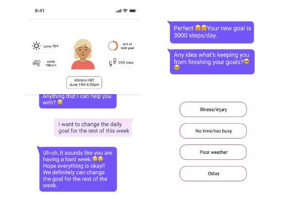

Hi! My name is Ziqi Yang 杨子祺. 
Starting Fall 2024, I have been an Informatics PhD student at **University of California, Irvine**, Donald Bren School of Informatics and Computer Science. My research interests lies in human-computer interaction and personal health informatics. I am lucky to be advised by **Prof. Yunan Chen** and working with **Prof. Daniel Epstein** on my research project(s) :)

Prior to joining UCI, I got my master's degree in Information Science at **the University of Michigan, Ann Arbor** majoring in User Experience and Human-Computer Interaction, where I worked with Prof. Mark Newman and Prof. Pedja Klasnja on projects on mobile health interventions. I also worked with Prof. Dakuo Wang at Northeastern University studying LLMs for patient-provider communication for older adults and cancer patients.

I gradutated from Shanghai Jiao Tong University with a bachelor's degree in Electrical and Computer Engineering in 2022. I also took electives in Industrial Design and social sciences from SJTU School of Design and University of California, Berkeley. 

See more in my recent [CV](https://github.com/EugeniaYang/Ziqi-Yang-CV/blob/13a5c12c70548da422513be155b8888011046d06/Ziqi_Yang_CV.pdf)
and [Portfolio](https://ziqis-portfolio.webflow.io/)

# Research Highlights

### LLM CAs to Address Patient-Provider Communication Challenges

  

    

      
    

    

      

      <strong>Ziqi Yang*</strong>, Xuhai Xu*, Bingsheng Yao, Ethan Rogers, Shao Zhang, Stephen Intille, Nawar Shara, Guodong Gordon Gao, and Dakuo Wang. 2024. Talk2Care: An LLM-based Voice Assistant for Communication between Healthcare Providers and Older Adults. <em>Proc. ACM Interact. Mob. Wearable Ubiquitous Technol.</em> 8, 2, Article 73 (May 2024), 35 pages. 
        <a href="https://doi.org/10.1145/3659625">[PDF]</a>
        <a href="https://youtu.be/fMMDN7gZGjs">[Video]</a>
    

    <ul style="list-style: disc; padding-left: 20px;">
        <li>Advisor: Professor Dakuo Wang, Northeastern University</li>
      </ul>
    

  

    

      

      <strong>Ziqi Yang*</strong>, Yuxuan Lu*, Jennifer Bagdasarian, Vedant Das Swain, Ritu Agarwal, Collin Campbell, Waddah Al-Refaire, Jehan El-Bayoumi, Guodong (Gordon) Gao, Nawar Shara, Dakuo Wang, Bingsheng Yao. RECOVER: Designing a Large Language Model-based Remote Patient Monitoring System for Postoperative GI Cancer Care <em>(Submitted to CHI'25)</em>
    

    

        

      
<strong>Ziqi Yang</strong>, Xuhai Xu, Bingsheng Yao, Jiachen Li, Jennifer Bagdasarian, Guodong Gao, Dakuo Wang.
      Is AI a Silver Bullet? Exploring Challenges and Opportunities of Patient-Provider Communication in Post-Treatment Cancer Care
      <a href="https://arxiv.org/abs/2404.13409">[PDF]</a>
      <em>(Submitted to CSCW’25)</em>
      

    

  

### Mobile Health Interventions

  

  

    

      
    

    

      
A Pre-study of The Effects of Empathy and Personality of Chatbots on Increasing The Intention of Chatbot Continuance
        <a href="https://drive.google.com/file/d/1R8OSR61UOyUseOvf2t_uAYz-JDCtbojh/view?usp=drive_link">[PDF]</a>
    

      <ul style="list-style: disc; padding-left: 20px;">
        <li>Advisor: Professor Mark Newman, Professor Pedja Klasnja, University of Michigan, Ann Arbor</li>
        <li>Working with PhD student Yuxuan Li at UMSI</li>
      </ul>
    

  

<!-- See my research projects here -->

<!-- Facebook for People with Dementia - Critique and Redesign
- Accessibility / Older Adults / Interaction Design
- Supervisor: Dr. Robin Brewer, University of Michigan, Ann Arbor
- [Project Paper](https://drive.google.com/file/d/1yKaZgQ0l5ZG7jOVQh-FoweCtiBrTROZ9/view?usp=share_link)

Bilibili/Cake-Making: An Online Community Analysis
- Social Computing / Online Communities
- Supervisor: Dr. Nazanin Andalibi, University of Michigan, Ann Arbor
- [Project Report](https://drive.google.com/file/d/1yKaZgQ0l5ZG7jOVQh-FoweCtiBrTROZ9/view?usp=share_link)  -->

<!-- # UX Research and Design --> 

<!-- I was/am previously 
- a UX designer intern at Microsoft(C+AI) and 
- product manager intern at eBay (Data Infrastructure) and Red 小红书. 

I researched the needs and pain points for professionals such as supply chain managers, data engineers, as well as vast number of consumers on social media. I aimed to design and develop products and promotes working efficiency or content quality and addresses affordance with the help of algorithms.
-->

<!--  
# Skills and Interests

I like photography, travelling, and (recently) gardening. Chat with me if you are interested!

 -->
